# Django 웹 구현

> Django를 활용한 웹 구현 진행 과정


### Django 설치하기

##### Django 설치 

- cmd 창을 켜서 입력

```shell
pip install Django==2.2.1
```

##### Django 설치 확인

```shell
python -m django --version
```

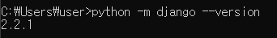


### 프로젝트 구성하기

##### 프로젝트 생성

- GameIssueWeb 이라는 이름의 프로젝트 생성

```shell
django-admin startproject GameIssueWeb
```

##### 어플리케이션 구성

- cd 명령어를 통해 GameIssueWeb으로 이동 후 진행

```shell
python manage.py startapp game_issue_app
```

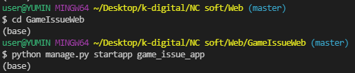

- GameIssueWeb > settings.py 수정

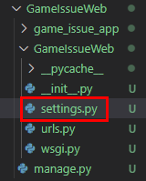

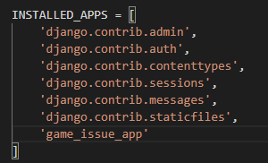

### 프로젝트 실행하기

##### 프로젝트 실행

```shell
python manage.py runserver
```

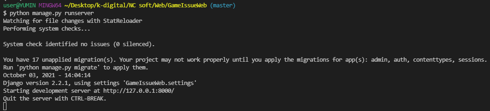

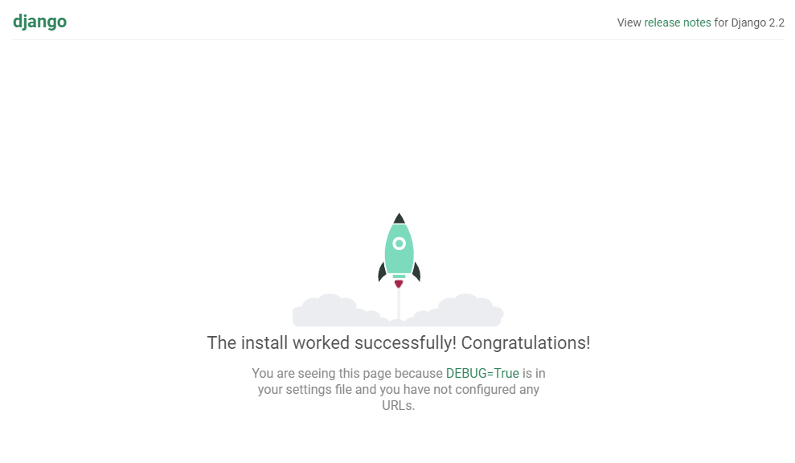

##### url 설정

- GameIssueWeb > urls.py 수정

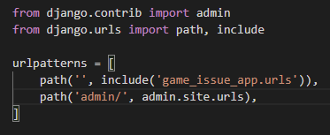

- game_issue_app > urls.py 생성

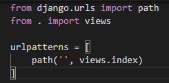

- game_issue_app > views.py 수정

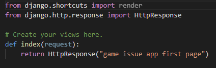

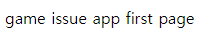

##### HTML 템플릿 사용

- game_issue_app > templates 폴더 생성  

-  templates 폴더에 index.html 붙여넣기
  - https://startbootstrap.com/template/small-business 에서 다운로드한 템플릿

- game_issue_app > views.py 수정

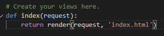

- index.html 수정

  - 맨 위 상단에 `` 추가

  - core thema 수정

    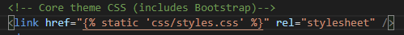

  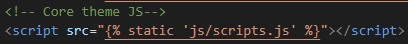

- GameIssueWeb > settings.py 수정

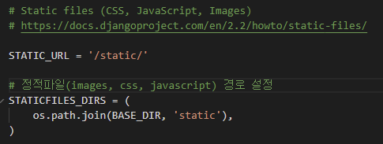

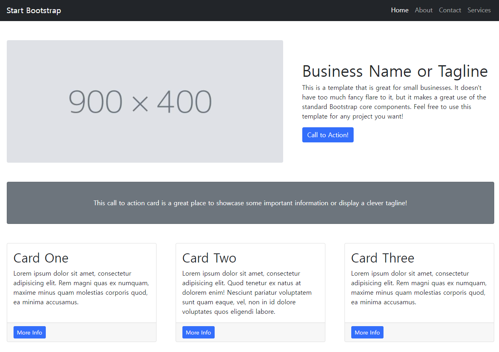

